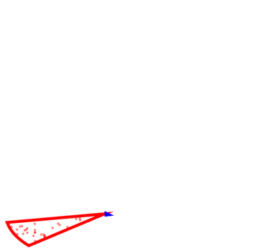
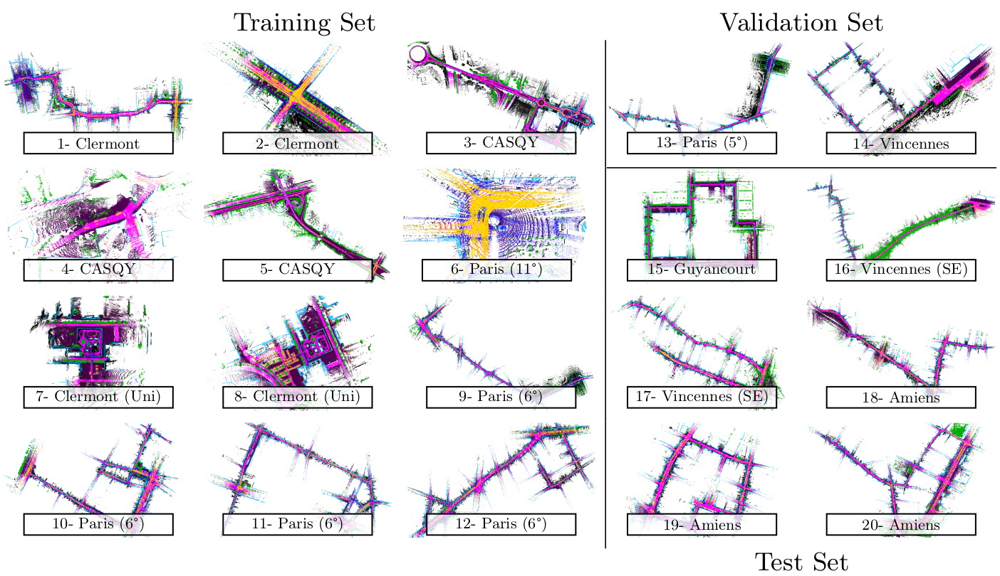

<div align="center">

#  HelixNet Toolbox 



</div>

This repository contains helper scripts to open, visualize, and process point clouds from the HelixNet dataset. It also contains scripts to process data from Semantic-Kitti [1, 2] in slices smaller than one full sensor rotation.

## HelixNet

- **Dataset presentation**

We introduce HelixNet, a new large-scale and open-access LiDAR dataset intended
for the evaluation of real-time semantic segmentation algorithms. In contrast to
other large-scale datasets, HelixNet includes fine-grained data about the sensor’s
rotation and position, as well as the points’ release time.

| :arrow_forward: 8.85B annotated points | :arrow_forward: 20 sequences | :arrow_forward: 78k LiDAR rotations |
:-------------------------------------------- | :-------------------------------------------------- | :------------------------------
:arrow_forward: **9 classes** | :arrow_forward: **6 cities** | :arrow_forward: **dense sensor information** |

## Usage 

- **Download** 

The dataset can be downloaded from [Zenodo](https://zenodo.org/deposit/6519817)

[](https://zenodo.org/deposit/6519817)


- **Data loading** 

This repository contains: 

```markdown
📦HelixNet
 ┣ 📂configs       # hydra config files for both datasets
 ┣ 📂helixnet      # PytorchLightning datamodules for both datasets
 ┃ ┣ 📂laserscan   # .py files loading individual files
 ┣ 📂misc          # helpers for visualisation in CloudCompare
 ┣ 📂demos         # some illustrative notebooks
 ```

- **Visualization and Usage** 

See our notebooks in `/demos` for examples of data manipulation and several visualization functions for semantic segmentation.

## Leaderboard
Please open an issue to submit new entries. Mention if the work has already been published and wether the code accessible for reproducibility. We require that at least a preprint is available to add an entry.

We use a 9-classes nomenclature: road (16.4% of all points), other surface (22.0%), building (31.3%), vegetation (8.5%), traffic signs (1.6%), static vehicle (4.9%), moving vehicle (2.1%), pedestrian (0.9%), and artifact (0.05%).

Methods that are real-time (Inf. time < Acq. time) are denoted with :heavy_check_mark:, methods that are not with :x:.  

---

### Semantic Segmentation 1/5 Frame (Online) :  Acquisition Time = 21ms

| Model name | #Params (M)  |  mIoU | Inf. (ms) | Published |
| ---------  |---- |---- | ---| --- |
|Helix4D     | 1.0   | 78.7 | :heavy_check_mark: 19  | :heavy_check_mark: [link](https://romainloiseau.fr/helixnet/) |
|Cylinder3D*  | 55.9 | 75.0 | :x: 54 | :heavy_check_mark: [link](https://github.com/xinge008/Cylinder3D) |
|PolarNet*    | 13.6 | 72.2 | :x: 36  | :heavy_check_mark: [link](https://github.com/edwardzhou130/PolarSeg) |
|SPVNAS*     | 10.8  | 69.9 | :x: 44  | :heavy_check_mark: [link](https://github.com/mit-han-lab/spvnas) |
|SalsaNeXt*   | 6.7  | 68.2 | :heavy_check_mark: 10  | :heavy_check_mark: [link](https://github.com/slawomir-nowaczyk/SalsaNext) |

### Semantic Segmentation Frame-by-Frame :  Acquisition Time = 104ms

| Model name | #Params (M)  |  mIoU | Inf. (ms) | Published |
| ---------  |---- |---- | ---| --- |
|Helix4D     | 1.0   | 79.4 | :heavy_check_mark: 45  | :heavy_check_mark: [link](https://romainloiseau.fr/helixnet/) |
|Cylinder3D*  | 55.9 | 76.6 | :x: 108 | :heavy_check_mark: [link](https://github.com/xinge008/Cylinder3D) |
|PolarNet*    | 13.6 | 73.6 | :heavy_check_mark: 49  | :heavy_check_mark: [link](https://github.com/edwardzhou130/PolarSeg) |
|SPVNAS*     | 10.8  | 73.4 | :heavy_check_mark: 73  | :heavy_check_mark: [link](https://github.com/mit-han-lab/spvnas) |
|SalsaNeXt*   | 6.7  | 69.4 | :heavy_check_mark: 23  | :heavy_check_mark: [link](https://github.com/slawomir-nowaczyk/SalsaNext) |


Models that we re-trained ourselves are denoted with a star (*).

---

## Citation   

If you use this dataset and/or this API in your work, please cite our [paper](path-to-the-paper-page):

```
@article{loiseau22online,
  title={Online Segmentation of LiDAR Sequences: Dataset and Algorithm.},
  author={Romain Loiseau and Mathieu Aubry and Loïc Landrieu},
  journal={arXiv:2206.08194},
  month={June},
  year={2022}
}
```

## Credits

- This work was supported by ANR project READY3D ANR-19-CE23-0007.
- The point cloud sequence of HelixNet was acquired during the Stereopolis II project. (_N. Paparoditis et al. "Stereopolis II: A multi-purpose and multi-sensor 3D mobile mapping system for street visualisation and 3D metrology." Revue française de photogrammétrie et de télédétection, 2012_)
- HelixNet was annotated by [FUTURMAP](https://www.futurmap.com/en/our-service/).
- We thank Zenodo for hosting the dataset. 
- This repository is highly inspired from https://github.com/PRBonn/semantic-kitti-api.

---

```
[1] J. Behley et al., SemanticKITTI: A Dataset for Semantic Scene Understanding of LiDAR Sequences, ICCV, 2016.
[2] A. Geiger et al., Are we ready for Autonomous Driving? The KITTI Vision Benchmark Suite, CVPR, 2012.
```
